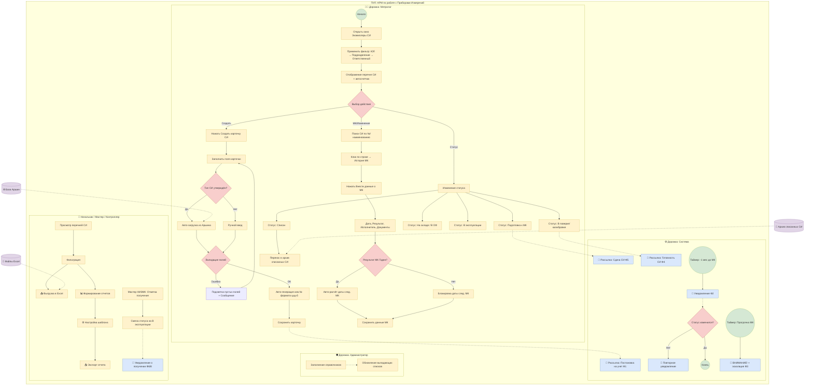

# 📊 Схема бизнес-процесса: АРМ по работе с СИ

```mermaid
graph TD
    %% === ПОЛ: АРМ по работе с СИ ===
    subgraph POOL_ARM["ПУЛ: АРМ по работе с Приборами Измерений"]
        
        %% === Дорожка: Метролог ===
        subgraph LANE_METROLOG["🧑‍🔧 Дорожка: Метролог"]
            Start((Начало)) --> OpenList[Открыть окно Экземпляры СИ]
            OpenList --> ApplyFilter[Применить фильтр: ЮЛ → Подразделение → Ответственный]
            ApplyFilter --> ViewList[Отображение перечня СИ + автосчетчик]
            ViewList --> ActionChoice{Выбор действия}
            
            %% Ветка: Создание карточки
            ActionChoice -->|Создать| CreateCard[Нажать Создать карточку СИ]
            CreateCard --> FillData[Заполнить поля карточки]
            FillData --> CheckArshin{Тип СИ утверждён?}
            CheckArshin -->|Да| FetchArshin[Авто-загрузка из Аршина]
            CheckArshin -->|Нет| ManualFill[Ручной ввод]
            FetchArshin --> Validate{Валидация полей}
            ManualFill --> Validate
            Validate -->|Ошибка| Highlight[Подсветка пустых полей + Сообщение]
            Highlight --> FillData
            Validate -->|ОК| AutoInv[Авто-генерация инв.№ формата ццц-б]
            AutoInv --> SaveCard[Сохранить карточку]
            
            %% Ветка: Внесение МК
            ActionChoice -->|МК/Изменения| FindSI[Поиск СИ по №/наименованию]
            FindSI --> SelectRow[Клик по строке → История МК]
            SelectRow --> OpenMKForm[Нажать Внести данные о МК]
            OpenMKForm --> FillMK[Дата, Результат, Исполнитель, Документы]
            FillMK --> CalcNext{Результат МК Годен?}
            CalcNext -->|Да| AutoDate[Авто-расчёт даты след. МК]
            CalcNext -->|Нет| ClearNext[Блокировка даты след. МК]
            AutoDate --> SaveMK[Сохранить данные МК]
            ClearNext --> SaveMK
            
            %% Ветка: Смена статуса
            ActionChoice -->|Статус| ChangeStatus[Изменение статуса]
            ChangeStatus --> SetPrep[Статус: Подготовка к МК]
            ChangeStatus --> SetMKStat[Статус: В поверке/калибровке]
            ChangeStatus --> SetWh[Статус: На складе / В ОФ]
            ChangeStatus --> SetOp[Статус: В эксплуатации]
            ChangeStatus --> SetWO[Статус: Списан]
            SetWO --> MoveArchive[Перенос в архив списанных СИ]
        end
        
        %% === Дорожка: Система ===
        subgraph LANE_SYSTEM["⚙️ Дорожка: Система"]
            SaveCard -.-> NotifyReg[📩 Рассылка: Постановка на учет Ф1]
            SetPrep -.-> NotifyPrep[📩 Рассылка: Сдача СИ Ф5]
            SetMKStat -.-> NotifyReady[📩 Рассылка: Готовность СИ Ф4]
            
            Timer1M((Таймер: -1 мес до МК)) --> SendMonth[📩 Уведомление Ф2]
            SendMonth -.-> CheckStat{Статус изменился?}
            CheckStat -->|Нет| ReNotify[📩 Повторное уведомление]
            CheckStat -->|Да| StopNotif((Конец))
            
            TimerOver((Таймер: Просрочка МК)) --> AlertEscalate[📩 ВНИМАНИЕ! + эскалация Ф3]
        end
        
        %% === Дорожка: Администратор ===
        subgraph LANE_ADMIN["🛡️ Дорожка: Администратор"]
            DictManage[Заполнение справочников] -.-> UpdateMenus[Обновление выпадающих списков]
        end
        
        %% === Дорожка: Пользователи ===
        subgraph LANE_USERS["👥 Начальник / Мастер / Контроллер"]
            ViewListU[Просмотр перечней СИ] --> FilterU[Фильтрация]
            FilterU --> ExportExcelU[📤 Выгрузка в Excel]
            FilterU --> GenReportU[📊 Формирование отчетов]
            GenReportU --> Template[⚙️ Настройка шаблона]
            Template --> ExportReport[📤 Экспорт отчета]
            
            MasterNI[Мастер НИЗМК: Отметка получения] --> ChangeStatusMaster[Смена статуса на В эксплуатации]
            ChangeStatusMaster -.-> NotifyMaster[📩 Уведомление о получении Ф6/8]
        end
    end
    
    %% === Внешние системы ===
    Arshin[("🌐 База Аршин")] -.-> FetchArshin
    Excel[("📁 Файлы Excel")] -.-> ExportExcelU
    ArchiveDB[("💾 Архив списанных СИ")] -.-> MoveArchive
    
    %% === Стили ===
    classDef event fill:#d5e8d4,stroke:#82b366;
    classDef task fill:#fff2cc,stroke:#d6b656;
    classDef decision fill:#f8cecc,stroke:#b85450;
    classDef system fill:#dae8fc,stroke:#6c8ebf;
    classDef storage fill:#e1d5e7,stroke:#9673a6;
    
    class Start,Timer1M,TimerOver,StopNotif event;
    class OpenList,ApplyFilter,ViewList,CreateCard,FillData,FetchArshin,ManualFill,AutoInv,SaveCard,FindSI,SelectRow,OpenMKForm,FillMK,AutoDate,ClearNext,SaveMK,ChangeStatus,SetPrep,SetMKStat,SetWh,SetOp,SetWO,MoveArchive,DictManage,UpdateMenus,ViewListU,FilterU,ExportExcelU,GenReportU,Template,ExportReport,MasterNI,ChangeStatusMaster task;
    class ActionChoice,CheckArshin,Validate,CalcNext,CheckStat decision;
    class NotifyReg,NotifyPrep,NotifyReady,SendMonth,ReNotify,AlertEscalate,NotifyMaster system;
    class Arshin,Excel,ArchiveDB storage;
```
